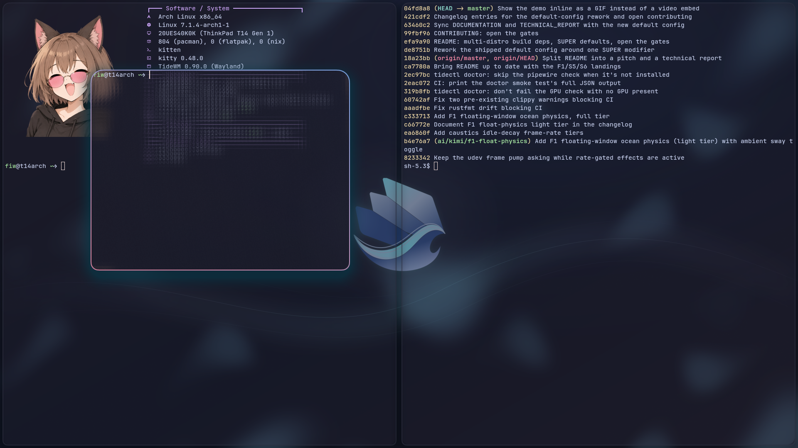
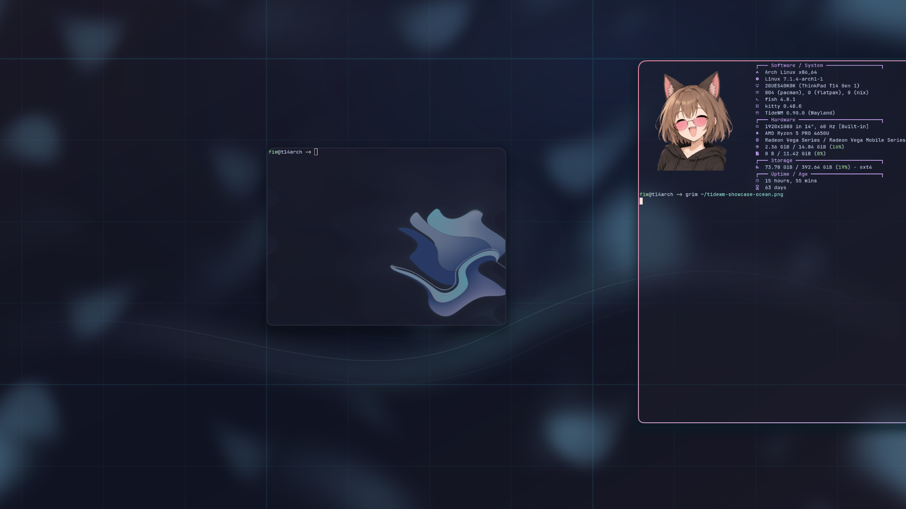

<div align="center">


# TideWM

**A Wayland desktop that feels like water.**


[](https://discord.gg/ZhkxA83cKk)

**[<kbd> <br> Try&nbsp;it <br> </kbd>](#try-it)**
**[<kbd> <br> Docs <br> </kbd>](DOCUMENTATION.md)**
**[<kbd> <br> Technical&nbsp;report <br> </kbd>](TECHNICAL_REPORT.md)**
**[<kbd> <br> Config <br> </kbd>](#configuration)**

</div>

Open a window and it ripples outward like a drop landing on a pond. Drag one and it sways. Switch workspaces and a wave sweeps the whole screen. It's not a screensaver sitting on top of your desktop, it's your desktop, and it runs fine on a laptop from 2015.

Underneath the water is a real tiling window manager: fast keyboard-driven layouts, multi-monitor, your older X11 apps still work, and a config file you edit and reload without restarting anything.

## See it


[Full-quality video (mp4)](share/media/demo-clasic.mp4) if the GIF is too compressed for your taste.

| Classic workspaces | The Ocean canvas |
| --- | --- |
|  |  |

## Why people are trying it

- **It actually looks like something.** Ripples on open, wave transitions between workspaces, glass and shadow on your windows, floating windows that drift like they're sitting on water. Every bit of it is a config toggle, and none of it costs you performance you'll notice.
- **Two ways to work.** Stick with classic numbered workspaces, or switch to Ocean: one endless zoomable canvas where every window lives in real 2D space instead of a workspace number. Switch between them live, no restart.
- **Runs on what you already own.** Measured at ~60-70MB PSS at idle with the full water stack on, ~63MB with nine frosted-glass windows -- about half of Hyprland on the same hardware -- and it only climbs past that if you turn on more than the defaults.
- **Genuinely yours.** Every ripple, wave, border, and shadow is a value in a config file, hot-reloaded on save. Nothing about how it looks is hardcoded.

## Try it

TideWM builds from source, there's no package yet. Rust stable plus a handful of Wayland/GPU dev libraries:

```bash
# Arch
sudo pacman -S pkg-config wayland systemd-libs libinput libxkbcommon mesa libdrm seatd

# Fedora
sudo dnf install pkgconf-pkg-config wayland-devel systemd-devel libinput-devel libxkbcommon-devel mesa-libEGL-devel mesa-libgbm-devel libdrm-devel libseat-devel

# Debian / Ubuntu
sudo apt install pkg-config libwayland-dev libudev-dev libinput-dev libxkbcommon-dev libegl1-mesa-dev libgbm-dev libdrm-dev libseat-dev
```

```bash
git clone https://github.com/Fi3w0/TideWM.git
cd TideWM
# `--features screencast` enables the portal screen-share backend (off by
# default: it pulls in the zbus async runtime and PipeWire threads).
# Without it, OBS/portal clients see no capture sources at all.
cargo build --release --locked --features screencast
cargo run --locked --features screencast   # opens nested inside your current session, safe to try
```

openSUSE and everything else, plus setting it up as a real login session: see [TECHNICAL_REPORT.md](TECHNICAL_REPORT.md#building).

## A taste of the defaults

| Shortcut               | Action                      |
| ---------------------- | --------------------------- |
| `Super+Enter`          | Open a terminal             |
| `Super+H/J/K/L`        | Focus a direction            |
| `Super+V`              | Float a window               |
| `Super+F`              | Fullscreen                   |
| `Super+1`..`Super+0`   | Switch workspace             |
| `Super+O`              | Workspace overview           |

Everything here is rebindable, and this is a small slice of what's available. The full action/keybind/IPC catalog lives in [DOCUMENTATION.md](DOCUMENTATION.md).

## Configuration

`~/.config/tidewm/config.wave`, generated with working defaults the first time you run it, already split into `config.wave` and `keybinds.wave` the way most people end up organizing it anyway. Save either one and TideWM picks up the change immediately, no restart.

```
# config.wave
include "keybinds.wave"

@mod = SUPER
terminal = wave(kitty, alacritty, foot, xterm)
```

```
# keybinds.wave
bind $mod+Return { spawn:kitty }
bind $mod+Q      { close-window }
```

`@` defines a variable, `$` references it in a bind, and everything hangs off that one `@mod`, so rebinding your primary modifier is a one-line change. Config is data on the surface and Lua underneath: colors and durations are real values (`600ms * 2` is `1200ms`, `primary.darken(0.35)` derives a palette), hardware conditionals read the `tide` table, `on "event"` blocks react to the session, and `tidectl eval` queries it all live. Full key-by-key reference: [DOCUMENTATION.md](DOCUMENTATION.md), and the format's design and rough edges: [WAVE.md](WAVE.md).

## About this project

I'm building TideWM solo. I use AI coding agents to move fast, then verify everything myself on real hardware before I trust it. If something breaks on your setup, that's genuinely useful, not an inconvenience, [open an issue](https://github.com/Fi3w0/TideWM/issues/new/choose) or drop into [Discord](https://discord.gg/ZhkxA83cKk).

For what's actually implemented, what's verified on real hardware, and what's still in progress: [TECHNICAL_REPORT.md](TECHNICAL_REPORT.md).

## Contributing

The gates are open: issues, forks, and pull requests are all genuinely welcome. Testing reports matter most right now, especially on other GPUs and distros, but code contributions have a place too. See [CONTRIBUTING.md](CONTRIBUTING.md).

## License

GPL-3.0, see [LICENSE](LICENSE). Copyright (C) 2026 Fi3w0.

&nbsp;

<div align="center">
<sub>Built on <a href="https://github.com/Smithay/smithay">Smithay</a>. Inspired by and borrows implementation patterns from <a href="https://github.com/YaLTeR/niri">niri</a>, <a href="https://github.com/malbiruk/driftwm">driftwm</a>, <a href="https://github.com/hyprwm/Hyprland">Hyprland</a>, and <a href="https://github.com/swaywm/sway">sway</a>.</sub>
</div>
