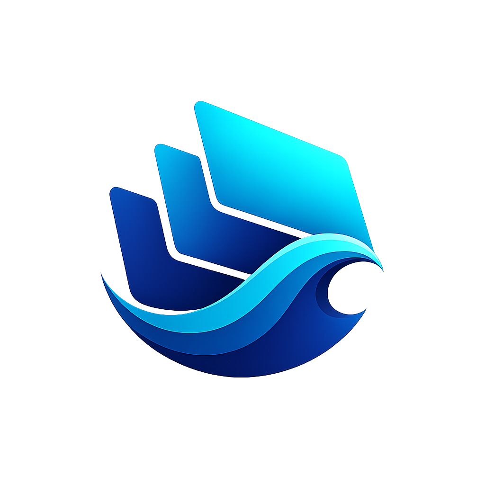

<div align="center">



# TideWM

A water-styled Wayland compositor, built in Rust on Smithay.


**[<kbd> <br> Docs <br> </kbd>](DOCUMENTATION.md)**
**[<kbd> <br> Quick&nbsp;Start <br> </kbd>](#quick-start)**
**[<kbd> <br> Building <br> </kbd>](#building)**
**[<kbd> <br> Config <br> </kbd>](#configuration)**
**[<kbd> <br> Contributing <br> </kbd>](CONTRIBUTING.md)**

</div>

> [!NOTE]
> Early development. Runs, tiles, and is being driven toward daily-driver quality. Water/aqua effects (ripples, wave transitions, liquid drag) are the whole point of this compositor and ship on by default once built, but aren't built yet -- the WM underneath them is what exists today.

Full modern tiling on the fundamentals -- BSP and master/stack, workspaces, groups, multi-monitor, layer-shell, IPC -- with a genuine water identity layered on top instead of bolted on after. Built for low-end hardware first: 1.5GB is the target ceiling in normal use, 3GB is the line where it gets actively optimized, not a number it's meant to sit near.

## Features

- Dynamic BSP tiling (dwindle-style) plus master/stack, switchable per workspace
- Workspaces per output, scratchpad, per-window pinning
- Window groups: tab several windows into one tile, first-party tab-strip UI
- Floating, fullscreen, maximize, pseudo-tiling
- Multi-monitor with hotplug, independent tiling tree per output, mixed-DPI
- Layer-shell: bars, launchers, lock screens
- XWayland, via [`xwayland-satellite`](https://github.com/Supreeeme/xwayland-satellite)
- Screenshots, clipboard, session lock
- Hot-reloadable config in Waves, TideWM's own format, split across files, `env`/`$variables`/`$wave(...)`
- Per-app window rules
- Submaps: temporary keybind layers (sway/Hyprland's "mode")
- Workspace overview (`Super+O`)
- Keyboard layout and touchpad (libinput) config
- JSON IPC socket, plus a `tidectl` CLI over it
- Server-side decorations enforced
- First-boot hint on an empty desktop, gone once you open a window or edit config

Full config reference, every action string, and the protocol matrix: [DOCUMENTATION.md](DOCUMENTATION.md).

## Status

- **Multi-monitor**: yes, core to the design from the start. Mixed-DPI via `wp-fractional-scale-v1`.
- **XWayland**: yes, via xwayland-satellite. X11 apps tile like any other window.
- **Nested (dev/testing)**: yes, `cargo run` opens TideWM as a window inside any existing session.
- **Real hardware**: verified on AMD -- backend, tiling, pointer-constraints (tested against real Minecraft), interactive drag/resize.
- **Nvidia**: overlay-plane workaround is built in, not yet run on real Nvidia hardware.
- **DPMS / gamma / lid-switch**: protocol-complete, real hardware behavior not yet verified.
- **Touchpad config**: built (tap, natural-scroll, accel, click-method, ...), not yet verified on real hardware.
- **Touchpad/mouse gestures**: not built.
- **Screencasting**: screenshots work; OBS/browser screen-*recording* doesn't yet.
- **AUR package**: not yet -- build from source below.

## Quick Start

`Super` is the default modifier. Default terminal is `kitty`; override in config.

| Shortcut                    | Action                               |
| --------------------------- | ------------------------------------ |
| `Super+Enter`               | Spawn terminal                       |
| `Super+Q`                   | Close window                         |
| `Super+Shift+Q`             | Quit TideWM                          |
| `Super+1`..`Super+9,0`      | Switch workspace (1..10)             |
| `Super+Shift+<N>`           | Move window to workspace N           |
| `Super+H/J/K/L`             | Focus left/down/up/right             |
| `Super+Shift+H/J/K/L`       | Swap with neighbor in direction      |
| `Super+V`                   | Toggle floating                      |
| `Super+F`                   | Toggle fullscreen                    |
| `Super+Shift+P`             | Toggle pseudo-tile                   |
| `Super+P`                   | Toggle pin (floats above workspaces) |
| `Super+Tab`                 | Cycle focus                          |
| `Super+Minus`               | Toggle scratchpad                    |
| `Super+Ctrl+H/J/K/L`        | Group window with neighbor           |
| `Super+[/]`                 | Cycle tab in a group                 |
| `Super+W` / `Super+Shift+W` | Layout: BSP / master-stack           |
| `Super+O`                   | Toggle workspace overview            |

Mouse:

| Input                        | Action                                |
| ---------------------------- | ------------------------------------- |
| `Super` + left-drag          | Move floating window                  |
| `Super` + right-drag         | Resize floating window                |
| `Super` + left-drag (tiled)  | Pick up and drop into a new tile slot |
| `Super` + right-drag (tiled) | Resize the tile from an edge          |
| Click on a split gap         | Drag to adjust the split ratio        |

Full set, plus every action string and IPC/`tidectl` command, in [DOCUMENTATION.md](DOCUMENTATION.md). Rebind anything in `[keybinds]`.

## Building

**Rust toolchain:** stable, 1.86+.

**Native dependencies:**

| Library        | Notes                                                                                         |
| -------------- | --------------------------------------------------------------------------------------------- |
| `pkg-config`   | Build-time only                                                                               |
| `wayland`      | `libwayland-client`/`-server`/`-egl`                                                          |
| `libudev`      | `systemd-libs` on systemd distros, `eudev`/`libudev-zero` elsewhere. Doesn't require systemd. |
| `libinput`     |                                                                                               |
| `libxkbcommon` |                                                                                               |
| `mesa`         | `libEGL`, `libgbm`                                                                            |
| `libdrm`       |                                                                                               |
| `libseat`      | The `seatd` package on most distros; also works against systemd-logind.                       |

```bash
sudo pacman -S pkg-config wayland systemd-libs libinput libxkbcommon mesa libdrm seatd  # Arch
```

Optional: [`xwayland-satellite`](https://github.com/Supreeeme/xwayland-satellite) for X11 apps (`xwayland.enabled = false` to skip).

```bash
git clone https://github.com/Fi3w0/TideWM.git
cd TideWM
cargo build --release --locked
```

### Running

```bash
cargo run --locked
```

Backend auto-selects: nested (winit) when `WAYLAND_DISPLAY`/`DISPLAY` is set, standalone TTY/DRM (udev) otherwise -- switch to a free VT with neither set to try it standalone.

To launch from a display manager (GDM, SDDM, greetd): put the `tidewm` binary on `PATH`, copy `share/wayland-sessions/tidewm.desktop` into `/usr/share/wayland-sessions/`, and `share/icons/tidewm.png` into `/usr/share/pixmaps/tidewm.png` for the session picker's icon.

## Configuration

`~/.config/tidewm/config.wave`, generated with working defaults on first run. Hot-reload on save. Full key-by-key reference: [DOCUMENTATION.md](DOCUMENTATION.md).

Config is [Waves](DOCUMENTATION.md#waves-format), TideWM's own format: `key = value` is the rest of the line after the first `=` (no quoting needed for a spawn command's own flags), a line ending in `{` opens a real multi-line block, `#` comments. Splits across files (Hyprland's `source` idea, adapted):

```
# config.wave
include "monitors.wave"
include "keybinds.wave"

$mod = SUPER
terminal = $wave(kitty, alacritty, foot)
```

```
# keybinds.wave
bind $mod+Return = spawn:$terminal
```

## Contributing

Not actively soliciting outside contributions yet, but built to take them eventually. See [CONTRIBUTING.md](CONTRIBUTING.md).

## License

GPL-3.0, see [LICENSE](LICENSE). Copyright (C) 2026 Fi3w0.

&nbsp;

<div align="center">
<sub>Built on <a href="https://github.com/Smithay/smithay">Smithay</a>. Inspired by and borrows implementation patterns from <a href="https://github.com/YaLTeR/niri">niri</a>, <a href="https://github.com/malbiruk/driftwm">driftwm</a>, <a href="https://github.com/hyprwm/Hyprland">Hyprland</a>, and <a href="https://github.com/swaywm/sway">sway</a>.</sub>
</div>
