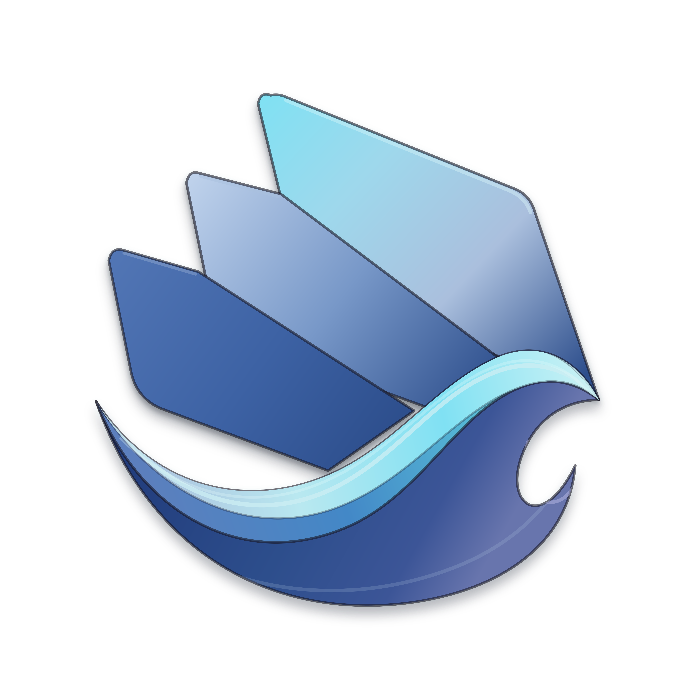

<div align="center">



# TideWM

A water-styled Wayland compositor, built in Rust on Smithay.


[](https://discord.gg/ZhkxA83cKk)

**[<kbd> <br> Docs <br> </kbd>](DOCUMENTATION.md)**
**[<kbd> <br> Quick&nbsp;Start <br> </kbd>](#quick-start)**
**[<kbd> <br> Building <br> </kbd>](#building)**
**[<kbd> <br> Config <br> </kbd>](#configuration)**
**[<kbd> <br> Contributing <br> </kbd>](CONTRIBUTING.md)**

</div>

> [!NOTE]
> TideWM already works as a real Wayland compositor: tiling, multi-monitor, workspaces, IPC, and most of the protocol surface a daily driver needs are all in. The full water/aqua identity is built now too: impulse ripples, wave workspace transitions, water-glass and per-app frosted glass, analytical shadows, rounded borders, configurable window animations, liquid move/resize viscosity, connected-vessel BSP resizing, opt-in floating sway, and automatic window depth/buoyancy. An IPC event-stream lets bars and widgets subscribe to live state instead of polling. Screen sharing (PipeWire/xdg-desktop-portal) works end to end on a real standalone session, verified through both OBS and Discord. All of the render work above is live-verified nested on real AMD hardware; the standalone udev/DRM pass on it is next. This is exactly the stage where testing on hardware I don't own is most useful, jump into [Discord](https://discord.gg/ZhkxA83cKk) if something breaks.

Full modern tiling on the fundamentals: BSP and master/stack, workspaces, groups, multi-monitor, layer-shell, IPC, with the water identity now taking shape on top. Built for low-end hardware first, 1.5GB is the target ceiling in normal use, 3GB is the line where it gets actively optimized.

## About

TideWM is a solo project. I use AI coding agents (OpenCode, Codex, Claude Code) to test and implement ideas quickly, then verify the result myself on real hardware before trusting it. Claude Sonnet 5.0 (xhigh) has done most of the work; GPT-5.6-Sol (xhigh) is the second most used model, with Kimi 3.0 and GLM 5.2 picking up smaller or parallel tasks. Every protocol/backend claim in the docs is marked with its actual verification status rather than "should work".

## Features

- Dynamic BSP tiling (dwindle-style), master/stack, and cascade (fills the output in aspect-ratio-adapting rows), switchable per workspace
- Workspaces per output, scratchpads (the classic one plus any number of named ones), per-window pinning
- Window groups: tab several windows into one tile, first-party tab-strip UI
- Floating, fullscreen, maximize, pseudo-tiling
- Multi-monitor with hotplug, independent tiling tree per output, mixed-DPI
- Layer-shell: bars, launchers, lock screens
- XWayland, via [`xwayland-satellite`](https://github.com/Supreeeme/xwayland-satellite)
- Screenshots, clipboard, session lock
- PipeWire screencasting behind a feature flag, verified end to end through real OBS and Discord on a standalone session
- Selectable water-glass refraction or per-app adjustable frosted glass, rounded client clipping, animated active/inactive/urgent gradient borders, analytical drop shadows, configurable open/close/move window animations, liquid move/resize viscosity, connected-vessel BSP resizing, opt-in floating-window sway, configurable impulse ripples, full-screen water-wave workspace transitions, and automatic window depth/buoyancy with a per-window override rule
- A low-memory built-in Tide wallpaper; layer-shell wallpaper tools replace it normally
- Hot-reloadable config in Waves, TideWM's own format, split across files, `env`/`$variables`/`$wave(...)`
- Per-app window rules, including regex matching, initial fullscreen/maximize, capture privacy, and window swallowing
- Submaps: temporary keybind layers (sway/Hyprland's "mode")
- Workspace overview (`Super+O`)
- Keyboard layout and touchpad (libinput) config
- JSON IPC socket with a subscribe/event-stream mode for bars and widgets, plus a `tidectl` CLI over it
- Server-side decorations enforced
- First-boot hint on an empty desktop, gone once you open a window or edit config
- Persistent, workspace-reserving config-error panel plus the existing reload/debug toasts

Full config reference, every action string, and the protocol matrix: [DOCUMENTATION.md](DOCUMENTATION.md).

## Status

- **Multi-monitor**: yes, core to the design from the start. Mixed-DPI via `wp-fractional-scale-v1`.
- **XWayland**: yes, via xwayland-satellite. X11 apps tile like any other window.
- **Nested (dev/testing)**: yes, `cargo run` opens TideWM as a window inside any existing session.
- **Real hardware**: verified on AMD, backend, tiling, pointer-constraints (tested against real Minecraft), interactive drag/resize.
- **Nvidia**: nested backend verified on a real RTX 3060 (proprietary driver 610.43): clean EGL/GLES context, correct rendering, no crashes. The standalone DRM backend and its overlay-plane workaround still need a native (TTY) Nvidia run.
- **DPMS / gamma**: protocol-complete and verified on AMD hardware; lid/tablet switches still need broader hardware coverage.
- **Touchpad config**: built (tap, natural-scroll, accel, click-method, ...), not yet verified on real hardware.
- **Touchpad gestures**: swipe/pinch can trigger any compositor action, plus a relative-workspace-swipe shortcut. Verified live on two real trackpads (an external USB Apple Magic Trackpad and a ThinkPad's built-in touchpad): all four swipe directions and pinch-in confirmed, pinch-out not yet confirmed.
- **Screencasting**: built behind `--features screencast` with a real `xdg-desktop-portal` backend. The SHM/MemFd path delivers real frames, verified on a standalone TTY (udev/DRM) session end to end through both real OBS and real Discord. DMA-BUF still fails on real hardware and stays disabled; MemFd/SHM is the supported transport.
- **Water/decoration effects**: the full identity and decoration set (ripples, wave transitions, water-glass, frost, shadows, borders, window animations, viscosity, connected-vessel resize, sway, depth/buoyancy) is live-verified nested on real AMD hardware. The standalone udev/DRM backend compiles against the same render path but hasn't had its own hardware pass yet.
- **AUR package**: not yet, build from source below.

## Roadmap

Foundation before visuals has been the plan from the start, and as of 0.60.0 the foundation part is done: the WM itself — tiling, multi-monitor, workspaces, layer-shell, IPC, XWayland, screencasting — is feature-complete, runs as a daily compositor on AMD hardware, and has passed a full nested test on real Nvidia hardware too. The render/visual-identity roadmap built on top of that is now fully implemented: the animation and backdrop-capture foundation, the water identity slice (ripples, wave transitions, water-glass, depth/buoyancy), full decoration parity (frost, shadows, rounded borders, window animations, viscosity, connected-vessel resize, opt-in sway), and an IPC event-stream for reactive bars/widgets. What's next, in order:

- **Standalone udev/DRM pass on the render effects.** Everything above is live-verified nested on real AMD hardware; the standalone backend compiles against the same render path but hasn't had its own hardware pass.
- **Feel-tuning.** Viscosity, sway, depth timings, and the transition/ripple presets ship with working defaults; the actual feel still gets refined against real use.
- **Cascade layout's manual resize.** The row-fill algorithm (`default_layout = cascade`) landed; per-cell drag resize is next.
- **The infinite ocean.** A design pass toward replacing discrete workspaces with a continuous swim-and-dive spatial model built on the depth system above. Planning stage, nothing coded yet.
- **Nvidia native run.** The nested (EGL/GLES) stack is verified on a real RTX 3060; the standalone DRM backend and its overlay-plane workaround still need a TTY session on Nvidia.
- **AUR package.** Not yet, build from source for now.

## Reporting bugs

Bug reports are genuinely welcome, especially hardware/driver reports — real-hardware testing is what moved this project from "compiles" to "works". The issue templates ask for the details that actually matter (backend, GPU, logs), so filling one out usually gets a fix moving without a round-trip of questions.

## Quick Start

`Super` is the default modifier. Default terminal is `kitty`; override in config.

| Shortcut                    | Action                               |
| ---------------------------- | ------------------------------------ |
| `Super+Enter`               | Spawn terminal                       |
| `Super+Q`                   | Close window                         |
| `Super+Shift+Q`             | Quit TideWM                          |
| `Super+1`..`Super+9,0`      | Switch workspace (1..10)             |
| `Super+Shift+<N>`           | Move window to workspace N           |
| `Super+H/J/K/L`             | Focus left/down/up/right             |
| `Super+Shift+H/J/K/L`       | Swap with neighbor in direction      |
| `Super+V`                   | Toggle floating                      |
| `Super+F`                   | Toggle fullscreen                    |
| `Super+Shift+P`             | Toggle pseudo-tile                   |
| `Super+P`                   | Toggle pin (floats above workspaces) |
| `Super+Tab`                 | Cycle focus                          |
| `Super+Minus`               | Toggle scratchpad                    |
| `Super+Ctrl+H/J/K/L`        | Group window with neighbor           |
| `Super+[/]`                 | Cycle tab in a group                 |
| `Super+W` / `Super+Shift+W` | Layout: BSP / master-stack           |
| `Super+O`                   | Toggle workspace overview            |

Mouse:

| Input                        | Action                                |
| ---------------------------- | -------------------------------------- |
| `Super` + left-drag          | Move floating window                  |
| `Super` + right-drag         | Resize floating window                |
| Left-drag a floating window's own edge | Resize it, no modifier needed |
| `Super` + left-drag (tiled)  | Pick up and drop into a new tile slot |
| `Super` + right-drag (tiled) | Resize the tile from an edge          |
| Click on a split gap         | Drag to adjust the split ratio        |

Full set, plus every action string and IPC/`tidectl` command, in [DOCUMENTATION.md](DOCUMENTATION.md). Rebind anything with `bind` in `config.wave`.

## Building

**Rust toolchain:** stable, 1.86+.

**Native dependencies:**

| Library        | Notes                                                                                         |
| -------------- | --------------------------------------------------------------------------------------------- |
| `pkg-config`   | Build-time only                                                                               |
| `wayland`      | `libwayland-client`/`-server`/`-egl`                                                          |
| `libudev`      | `systemd-libs` on systemd distros, `eudev`/`libudev-zero` elsewhere. Doesn't require systemd. |
| `libinput`     |                                                                                               |
| `libxkbcommon` |                                                                                               |
| `mesa`         | `libEGL`, `libgbm`                                                                            |
| `libdrm`       |                                                                                               |
| `libseat`      | The `seatd` package on most distros; also works against systemd-logind.                       |

```bash
sudo pacman -S pkg-config wayland systemd-libs libinput libxkbcommon mesa libdrm seatd  # Arch
```

Optional: [`xwayland-satellite`](https://github.com/Supreeeme/xwayland-satellite) for X11 apps (`xwayland.enabled = false` to skip).

```bash
git clone https://github.com/Fi3w0/TideWM.git
cd TideWM
cargo build --release --locked
```

### Running

```bash
cargo run --locked
```

Backend auto-selects: nested (winit) when `WAYLAND_DISPLAY`/`DISPLAY` is set, standalone TTY/DRM (udev) otherwise. Switch to a free VT with neither set to try it standalone.

To launch from a display manager (GDM, SDDM, greetd): put the `TideWM` binary (note the case, `[[bin]] name` in `Cargo.toml` builds it capitalized, and `tidewm.desktop`'s own `Exec=` line expects exactly that) on `PATH`, copy `share/wayland-sessions/tidewm.desktop` into `/usr/share/wayland-sessions/`, and copy `share/icons/TideWM-logo-faithful-4k.png` to `/usr/share/pixmaps/tidewm.png` for the session picker's icon.

### Screen sharing (works, verified through OBS and Discord)

Discord, OBS, and anything else that shares your screen go through `xdg-desktop-portal`, not TideWM directly. TideWM implements its own `org.freedesktop.impl.portal.ScreenCast` backend so no `xdg-desktop-portal-gnome`/GTK4 chain is needed. The PipeWire buffer path (SHM/MemFd) delivers real frames, verified end to end on a standalone TTY (udev/DRM) session through both real OBS and real Discord. DMA-BUF export stays disabled either way.

Build with `cargo build --release --locked --features screencast`, then install the portal files so `xdg-desktop-portal` knows to route screen-share requests to TideWM:

```bash
sudo cp share/xdg-desktop-portal/tidewm.portal /usr/share/xdg-desktop-portal/portals/
sudo cp share/xdg-desktop-portal/tidewm-portals.conf /usr/share/xdg-desktop-portal/
```

`xdg-desktop-portal` itself must already be installed (most distros ship it by default). Log in through TideWM's own session entry so `xdg-desktop-portal` picks up `XDG_CURRENT_DESKTOP=tidewm` and reads the config above. See [DOCUMENTATION.md](DOCUMENTATION.md)'s protocol matrix for the current verification status, and the [Roadmap](#roadmap) above for where this stands.

## Configuration

`~/.config/tidewm/config.wave`, generated with working defaults on first run. Hot-reload on save. Full key-by-key reference: [DOCUMENTATION.md](DOCUMENTATION.md).

Config is [Waves](DOCUMENTATION.md#waves-format), TideWM's own format: `key = value` is the rest of the line after the first `=` (no quoting needed for a spawn command's own flags), a line ending in `{` opens a real multi-line block, `#` comments. Splits across files (Hyprland's `source` idea, adapted):

```
# config.wave
include "monitors.wave"
include "keybinds.wave"

$mod = SUPER
terminal = $wave(kitty, alacritty, foot)
```

```
# keybinds.wave
bind $mod+Return = spawn:$terminal
```

## Contributing

Not soliciting code contributions yet, but this is exactly the point where testing reports matter most, especially on other GPUs and distros. Open an issue, or drop into [Discord](https://discord.gg/ZhkxA83cKk). See [CONTRIBUTING.md](CONTRIBUTING.md) for more.

## License

GPL-3.0, see [LICENSE](LICENSE). Copyright (C) 2026 Fi3w0.

&nbsp;

<div align="center">
<sub>Built on <a href="https://github.com/Smithay/smithay">Smithay</a>. Inspired by and borrows implementation patterns from <a href="https://github.com/YaLTeR/niri">niri</a>, <a href="https://github.com/malbiruk/driftwm">driftwm</a>, <a href="https://github.com/hyprwm/Hyprland">Hyprland</a>, and <a href="https://github.com/swaywm/sway">sway</a>.</sub>
</div>
